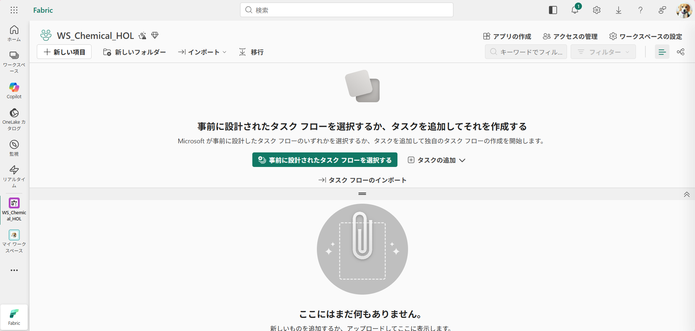
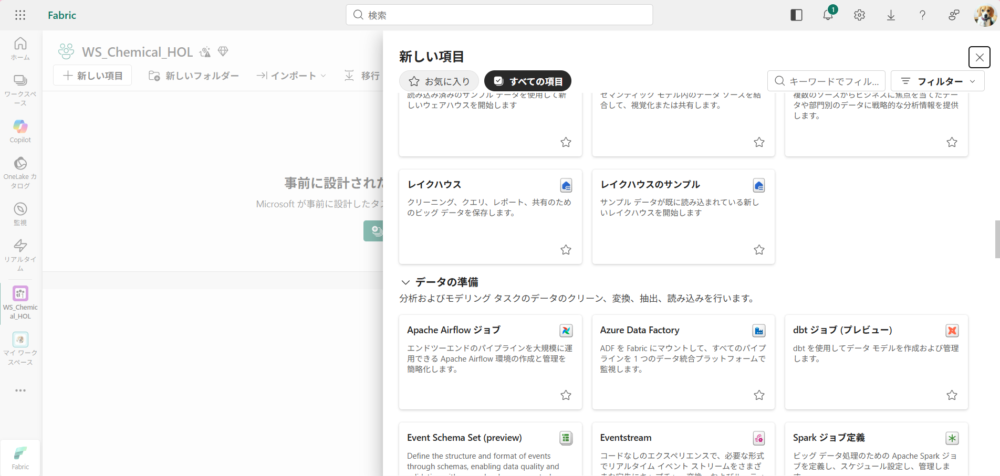
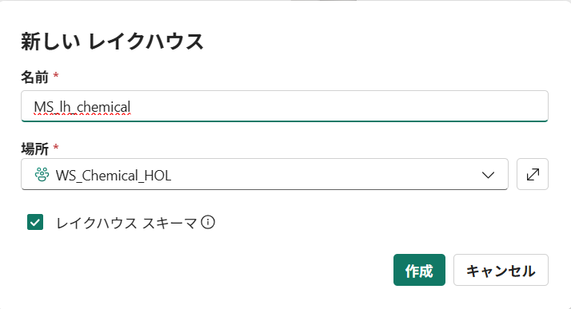
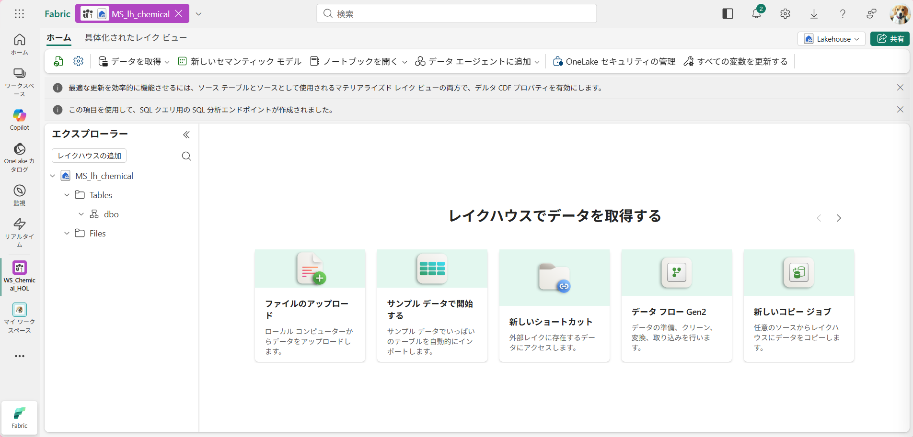

# Step1. Lakehouse の作成

ワークスペースに Lakehouse を作成します。

1. ワークスペースで **新しい項目** をクリックします。


2. **レイクハウス**　をクリックします


3. **[Prefix]_lh_chemical** という名称で作成します。
レイクハウススキーマのチェックボックスは入ったままで問題ありません。

```
MS_lh_chemical
```



## [参考] Notebookから作成
Notebookから実行する場合、下記のコードを実行します。
Fabric ワークスペースのGUIDの取得方法については、[Step0 事前準備](step00_preparation.md)を参照してください。
```python
WORKSPACE_ID   = ""    # 👈 Fabric ワークスペースの GUID を入力
WORKSPACE_NAME = ""    # 👈 Fabric ワークスペース名を入力

import sempy.fabric as fabric

LAKEHOUSE_NAME = ""    # 👈 [Prefix]_lh_chemical を入力

client = fabric.FabricRestClient()

resp = client.get(f"v1/workspaces/{WORKSPACE_ID}/lakehouses")
resp.raise_for_status()
lakehouses = resp.json().get("value", [])
existing = next((lh for lh in lakehouses if lh["displayName"] == LAKEHOUSE_NAME), None)

if existing:
    LAKEHOUSE_ID = existing["id"]
    print(f"ℹ️  Lakehouse '{LAKEHOUSE_NAME}' は既に存在します — 作成をスキップします。")
    print(f"   LAKEHOUSE_ID = {LAKEHOUSE_ID}")
else:
    resp = client.post(
        f"v1/workspaces/{WORKSPACE_ID}/lakehouses",
        json={"displayName": LAKEHOUSE_NAME},
    )
    resp.raise_for_status()
    LAKEHOUSE_ID = resp.json()["id"]
    print(f"✅ Lakehouse を作成しました: {LAKEHOUSE_NAME}")
    print(f"   LAKEHOUSE_ID = {LAKEHOUSE_ID}")
```

4. 作成されると下記のような画面が表示されます。


- [Step2. リファレンスデータのアップロード](../Instruction/step02_Upload_reference_data.md)
