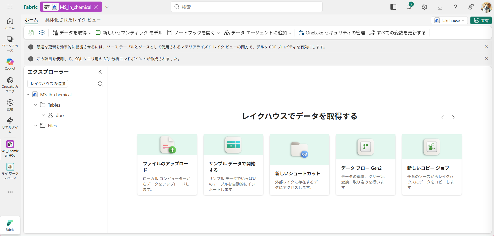
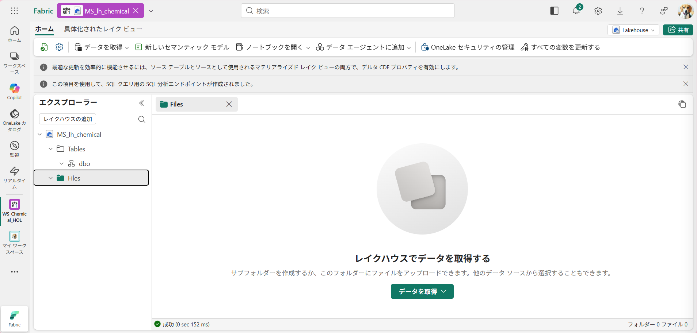
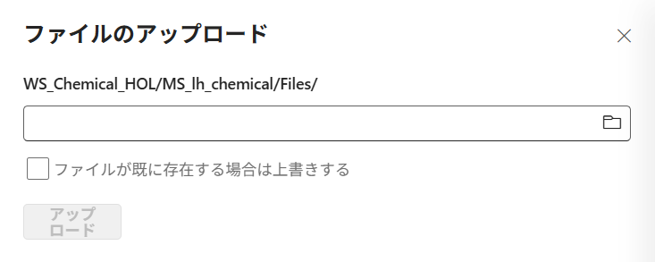
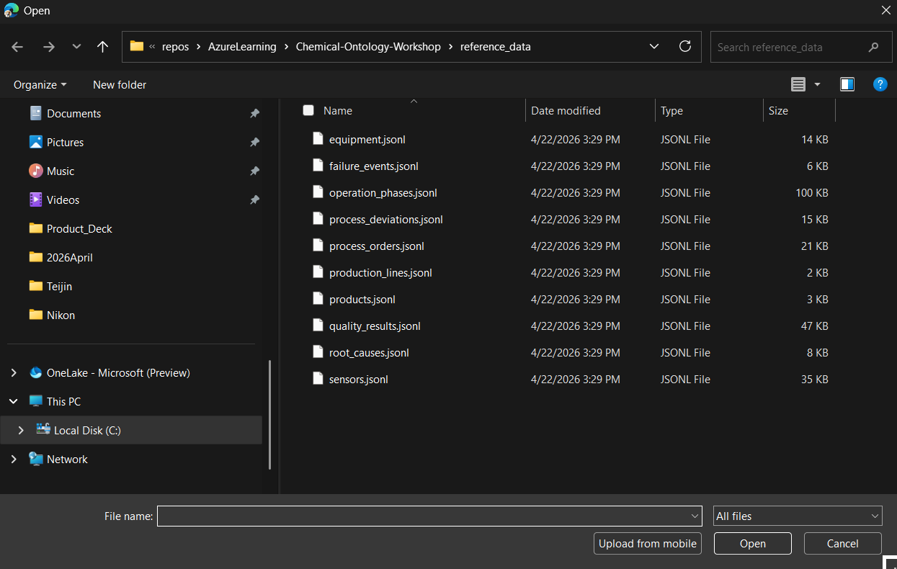
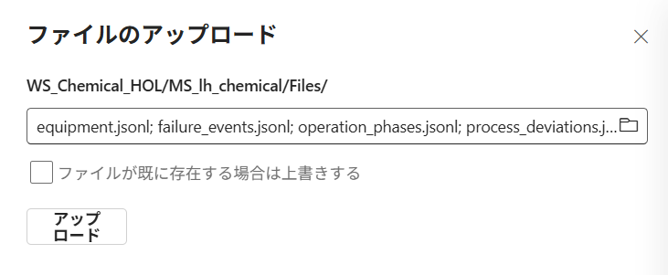
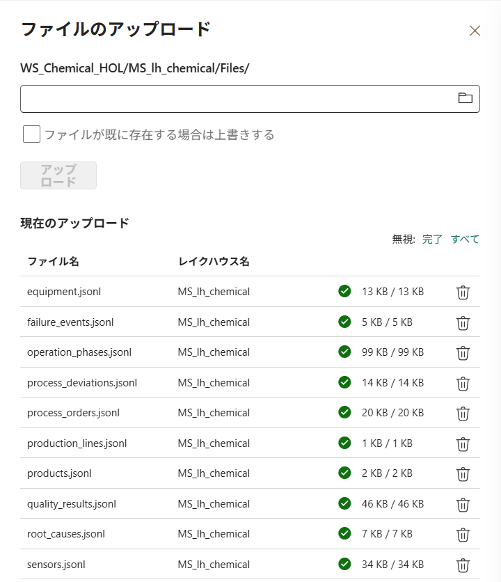

# Step2. リファレンスデータのアップロード

reference_data ファイル（10個のJSONLファイル）をStep1で作成したLakehouseに直接アップロードします。

### JSONLファイルの内容
|#|JSONLファイル名|内容|
|---|---|---|
|1|equipment|設備|
|2|failure_events|故障イベント|
|3|operation_phases|オペレーションフェーズ|
|4|process_deviations|プロセス逸脱|
|5|process_orders|プロセスオーダー|
|6|production_lines|製造ライン|
|7|products|製品|
|8|quality_results|品質検査結果|
|9|root_causes|根本原因|
|10|sensors|センサー|

1. Step1で作成したレイクハウスのエクスプローラーからFilesをクリックします。

2. **データを取得** をクリックし、ファイルのアップロードを選択します。

3. フォルダのマークをクリックして、Reference data フォルダの中の10個のJSONLファイルを選択します

アップロードが確認できればこのステップは完了です。
