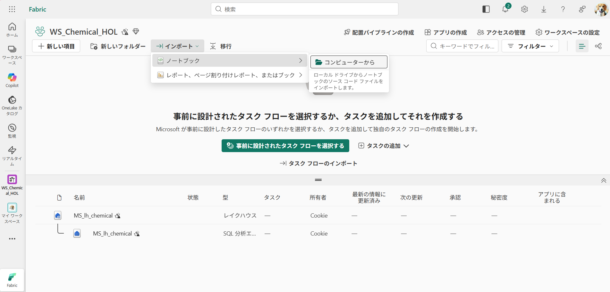
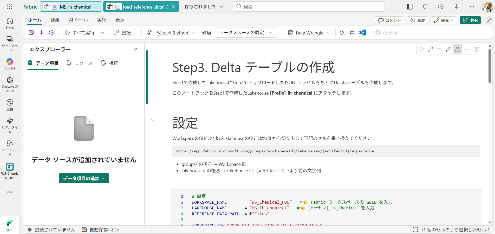
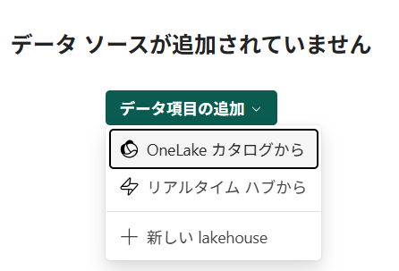
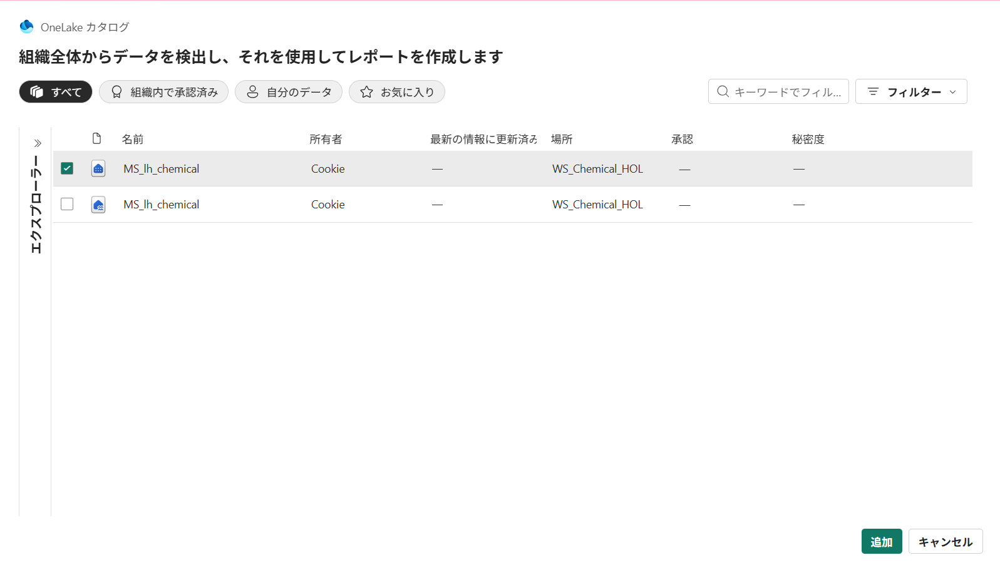
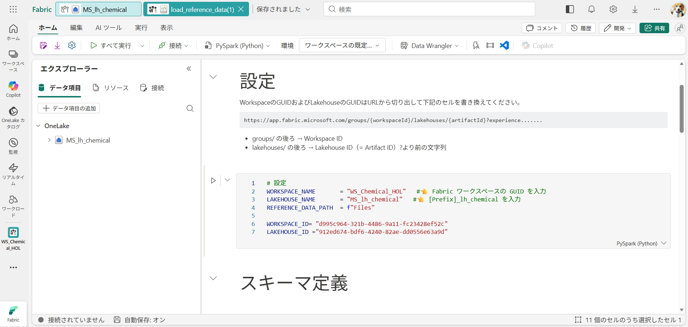
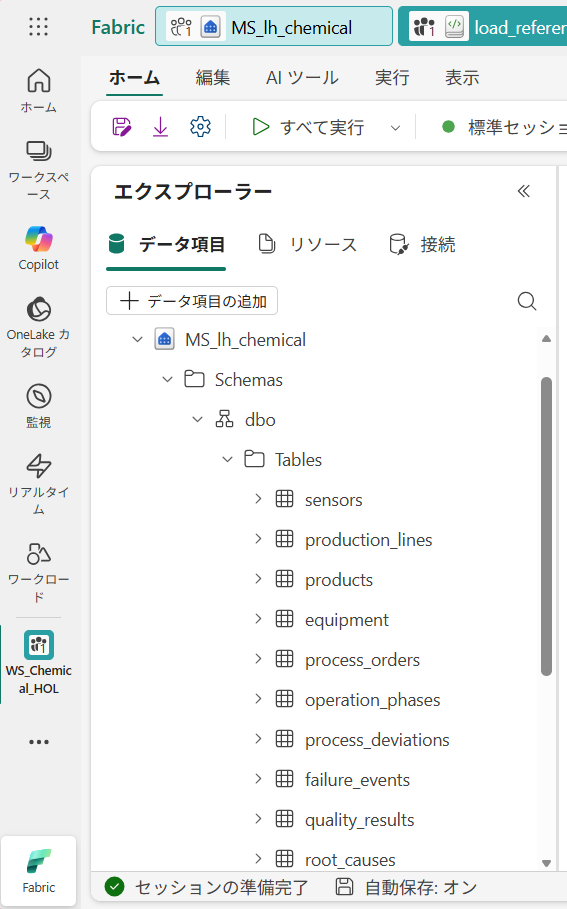

# Step3. Delta テーブルの作成

[Step1](step01_Lakehouse_Creation.md)で作成したLakehouseに[Step2](step02_Upload_reference_data.md)でアップロードしたJSONLファイルをもとにDeltaテーブルを作成します。

1. ワークスペースのトップ画面でインポート→ノートブック→コンピューターからをクリックし、Notebookをアップロードします。

2. アップロードしたNotebookを開きデータ項目の追加→OneLakeカタログからStep1で作成したLakehouseを選択し追加をクリックします。

 

3. 設定 の下のセルにWorkspaceのGUID、LakehouseのGUID、ワークスペース名、Lakehouse名を設定します。

4. エラーが出ていないことを確認しながら、セルを１つずつ順番に実行します
JSONLファイルをLakehouseテーブルに読み込むところで少し時間がかかります。RunningからCommand executedにステータスが変わるまで１分～数分かかることがあります。
エクスプローラーからLakehouse→Schemas→dbo→Tablesに10テーブル生成されます。

Next: [Step4. Eventhouse（KQL Database）の作成](../Instruction/step04_Create_Eventhouse.md)
