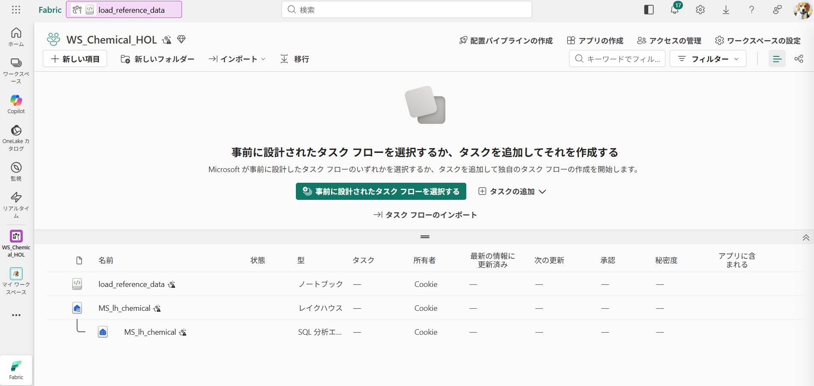
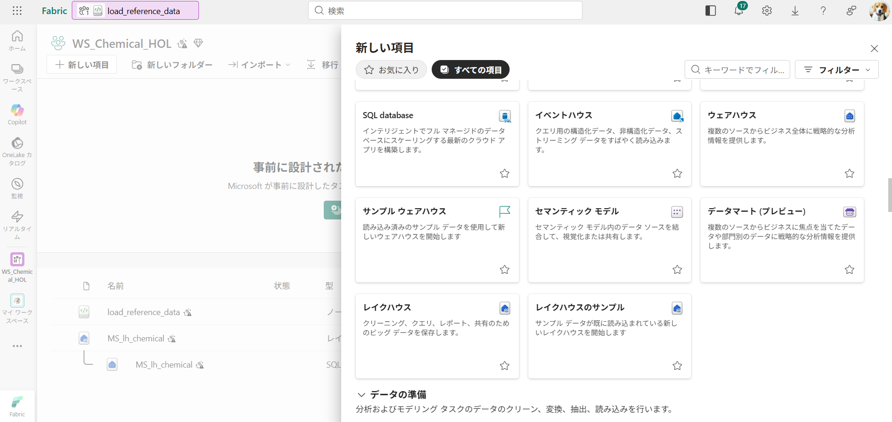
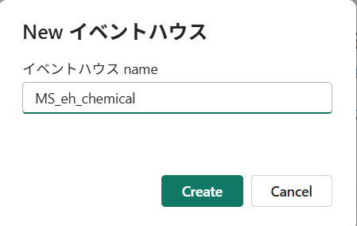
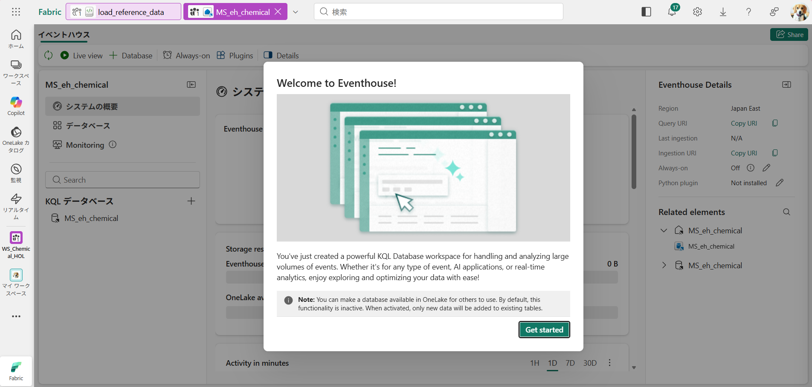
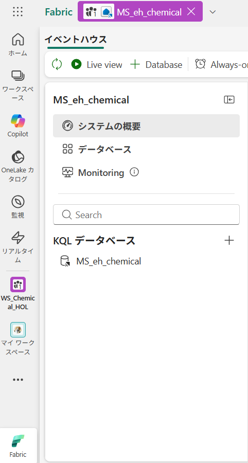
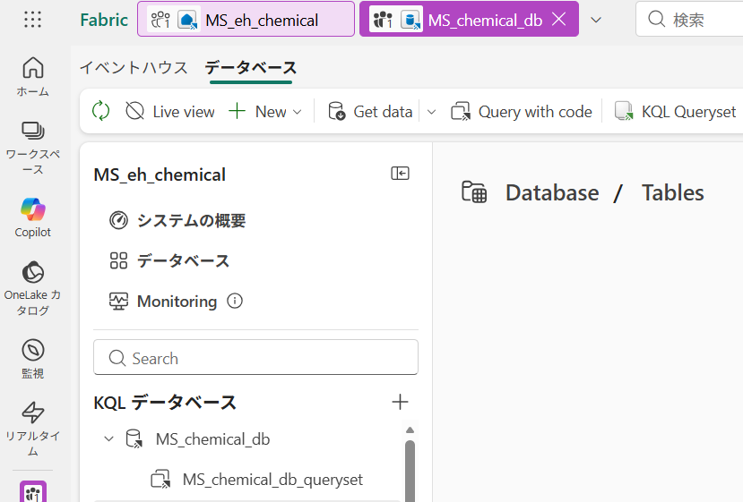
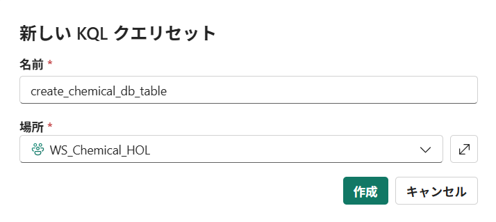

# Step4. Eventhouse（KQL Database）の作成

ワークスペースにEventhouse（KQL Database）を作成します。
Lakehouse のリファレンスデータを読み込み、化学プラント向けのリアルタイムイベントストリームを生成して Eventhouse（KQL Database）に取り込みます。

- **Eventhouse** `[Prefix]_eh_chemical`
- **KQL Database** `[Prefix]_chemical_db`
- **KQL テーブル**: 
    - SensorReadingEvent（センサー計測値）
    - ProcessAlarmEvent（プロセスアラーム）
    - EquipmentStatusEvent（設備状態変更）
    - BatchPhaseTransitionEvent（バッチフェーズ遷移）
    - QualityInspectionEvent（品質検査）

1. ワークスペースで **新しい項目** をクリックします。


2. **イベントハウス**　をクリックします


3. **[Prefix]_eh_chemical** という名称で作成します。


作成後の画面




4. KQL Queryset をクリックします。


5. create_chemical_db_table という名前で作成します。


6. 下記のKQLクエリを順番に貼り付けて実行します。

### 6-1 `SensorReadingEvent` の作成
```kusto
.create-merge table SensorReadingEvent (
    event_id: string,
    event_type: string,
    timestamp: datetime,
    source: string,
    sensor_id: string,
    equipment_id: string,
    production_line_id: string,
    process_order_id: string,
    tag_name: string,
    measurement_type: string,
    value: real,
    unit: string,
    normal_min: real,
    normal_max: real,
    alarm_low: real,
    alarm_high: real,
    is_within_normal: bool
)
```

```kusto
.alter table SensorReadingEvent policy retention ```{ "SoftDeletePeriod": "365.00:00:00", "Recoverability": "Enabled" }```
```

### 6-2. `ProcessAlarmEvent` の作成

```kusto
.create-merge table ProcessAlarmEvent (
    event_id: string,
    event_type: string,
    timestamp: datetime,
    source: string,
    sensor_id: string,
    equipment_id: string,
    production_line_id: string,
    process_order_id: string,
    tag_name: string,
    alarm_type: string,
    severity: string,
    threshold_value: real,
    actual_value: real,
    deviation_amount: real,
    action_taken: string
)
```

```kusto
.alter table ProcessAlarmEvent policy retention ```{ "SoftDeletePeriod": "365.00:00:00", "Recoverability": "Enabled" }```
```

### 6-3. `EquipmentStatusEvent` の作成

```kusto
.create-merge table EquipmentStatusEvent (
    event_id: string,
    event_type: string,
    timestamp: datetime,
    source: string,
    equipment_id: string,
    production_line_id: string,
    equipment_name: string,
    equipment_type: string,
    previous_status: string,
    new_status: string,
    reason: string
)
```

```kusto
.alter table EquipmentStatusEvent policy retention ```{ "SoftDeletePeriod": "365.00:00:00", "Recoverability": "Enabled" }```
```

### 6-4. `BatchPhaseTransitionEvent` の作成

```kusto
.create-merge table BatchPhaseTransitionEvent (
    event_id: string,
    event_type: string,
    timestamp: datetime,
    source: string,
    process_order_id: string,
    batch_number: string,
    product_id: string,
    production_line_id: string,
    previous_phase: string,
    new_phase: string,
    sequence_number: int,
    set_temperature: real,
    set_pressure: real,
    actual_temperature: real,
    actual_pressure: real
)
```

```kusto
.alter table BatchPhaseTransitionEvent policy retention ```{ "SoftDeletePeriod": "365.00:00:00", "Recoverability": "Enabled" }```
```

### 6-5. `QualityInspectionEvent` の作成

```kusto
.create-merge table QualityInspectionEvent (
    event_id: string,
    event_type: string,
    timestamp: datetime,
    source: string,
    process_order_id: string,
    batch_number: string,
    product_id: string,
    inspection_item: string,
    measured_value: real,
    spec_lower: real,
    spec_upper: real,
    pass_fail: string,
    lot_number: string
)
```

```kusto
.alter table QualityInspectionEvent policy retention ```{ "SoftDeletePeriod": "365.00:00:00", "Recoverability": "Enabled" }```
```

7. テーブル一覧およびスキーマの確認
下記のKQLクエリを実行します。

```kusto
.show tables | project TableName | order by TableName asc
```

期待される結果（5 行）:

| TableName |
|-----------|
| BatchPhaseTransitionEvent |
| EquipmentStatusEvent |
| ProcessAlarmEvent |
| QualityInspectionEvent |
| SensorReadingEvent |

```kusto
.show table SensorReadingEvent cslschema
.show table ProcessAlarmEvent cslschema
.show table EquipmentStatusEvent cslschema
.show table BatchPhaseTransitionEvent cslschema
.show table QualityInspectionEvent cslschema
```

Next: [Step5. イベントストリームの生成](../Instruction/step05_Generate_Eventstream.md)
