# Step6. オントロジーの作成

Fabric ポータルの GUI からオントロジー（プレビュー）を手作業で作成します。

## 1. オントロジー項目の新規作成

1. 左ナビ → **ワークスペース** → 対象ワークスペースを開く  
2. **+ 新しい項目** → 検索ボックスに `Ontology` と入力
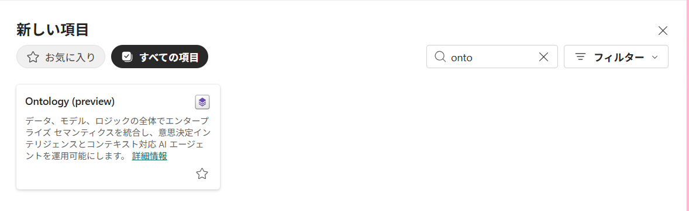
3. **Ontology (preview)** を選択  
4. 名前に `[Prefix]_ChemicalOntology` を入力 → **作成する**  
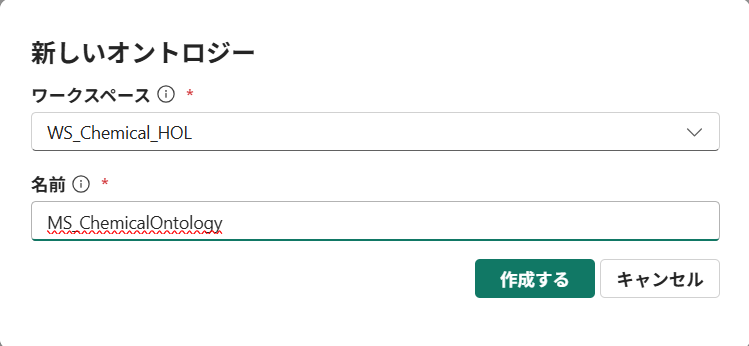

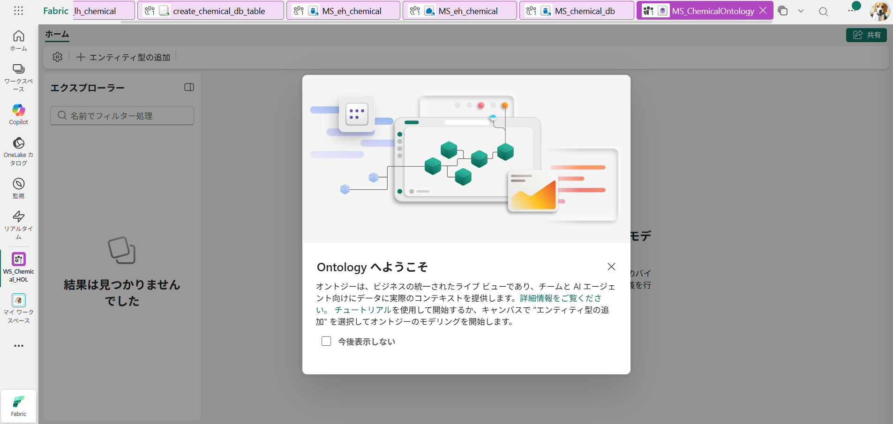
5. 既に同名が存在する場合は、まず古い方を削除してから作成（… → **削除**）

> 💡 既存オントロジーの削除直後は内部リソースの解放に **約30秒** 要します。削除後すぐに同名で再作成するとエラーになることがあります。

---
## 2. エンティティ型の作成（10 件）
Fabric の Ontology (preview) では、データソース（Lakehouse）はオントロジー全体ではなく **エンティティ型ごと** に紐付けます。したがって先にエンティティ型を作成し、その中で対象の Lakehouse テーブルを指定します。

対象テーブル一覧:

| テーブル | エンティティ名 | キー列 | 表示列 |
|---|---|---|---|
| `production_lines` | `ProductionLine` | `production_line_id` | `name` |
| `equipment` | `Equipment` | `equipment_id` | `name` |
| `sensors` | `Sensor` | `sensor_id` | `tag_name` |
| `products` | `Product` | `product_id` | `name` |
| `process_orders` | `ProcessOrder` | `process_order_id` | `batch_number` |
| `operation_phases` | `OperationPhase` | `operation_phase_id` | `phase_name` |
| `process_deviations` | `ProcessDeviation` | `process_deviation_id` | `deviation_type` |
| `quality_results` | `QualityResult` | `quality_result_id` | `lot_number` |
| `failure_events` | `FailureEvent` | `failure_event_id` | `failure_mode` |
| `root_causes` | `RootCause` | `root_cause_id` | `cause_classification` |

---
1. オントロジー画面上部の **+ エンティティ型 (Add entity type)** をクリック
2. ダイアログで **エンティティ型名** に上表の「エンティティ名」を入力（例: `ProductionLine`）→ **エンティティ型の追加**
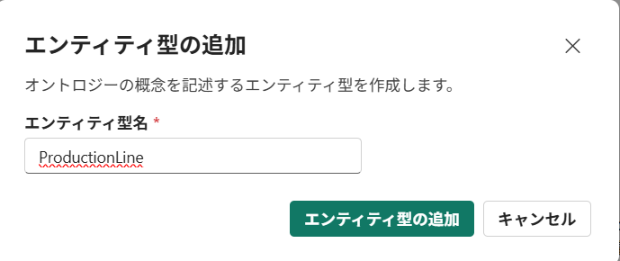
   - この時点ではまだデータソースは紐付いておらず、空のエンティティ型が作成されます
3. 作成されたエンティティ型を開き、**データからプロパティを追加 (Data binding)** をクリックします。
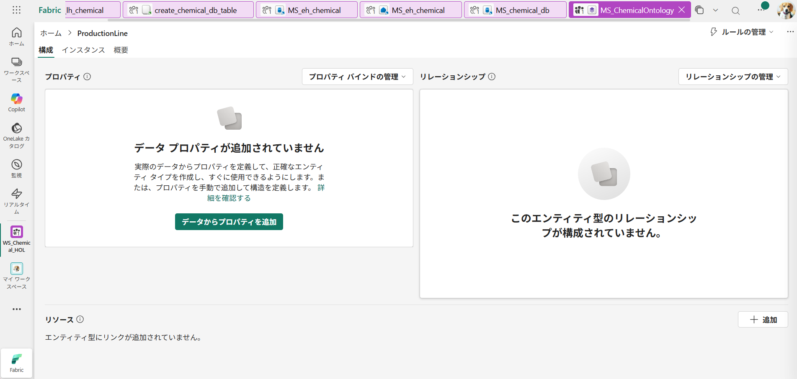
4. **+ データバインディングを追加 ** をクリックし、データソースを指定:
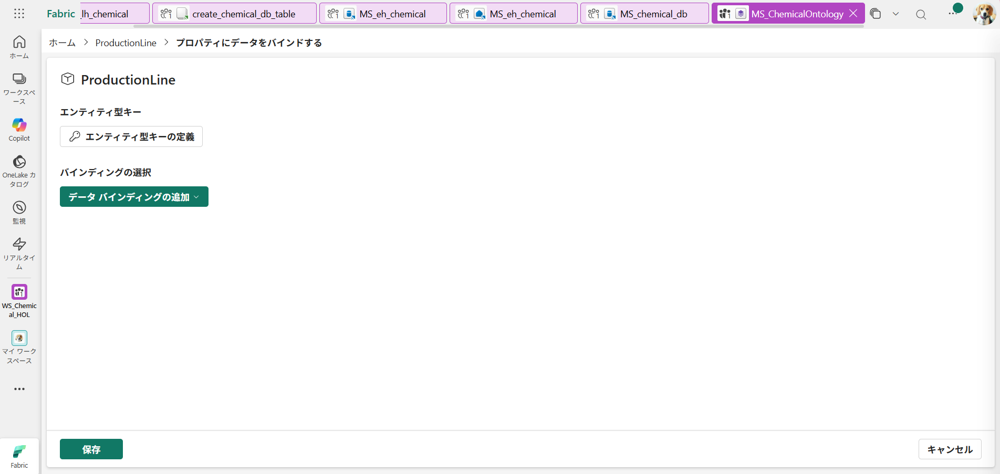
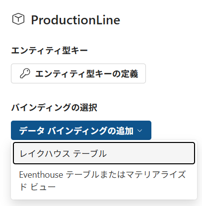
   - Source type: **レイクハウス テーブル**
   - **OneLake カタログ** → **Lakehouse** から `[Prefix]_lh_chemical` を選択
   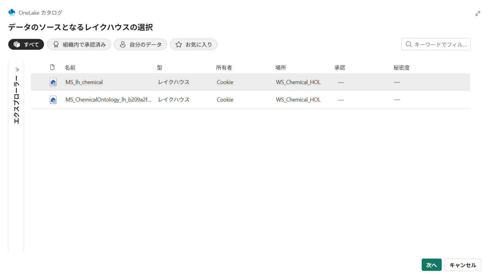
   - テーブル一覧から該当テーブル（例: `production_lines`）を選択 → **選択**
   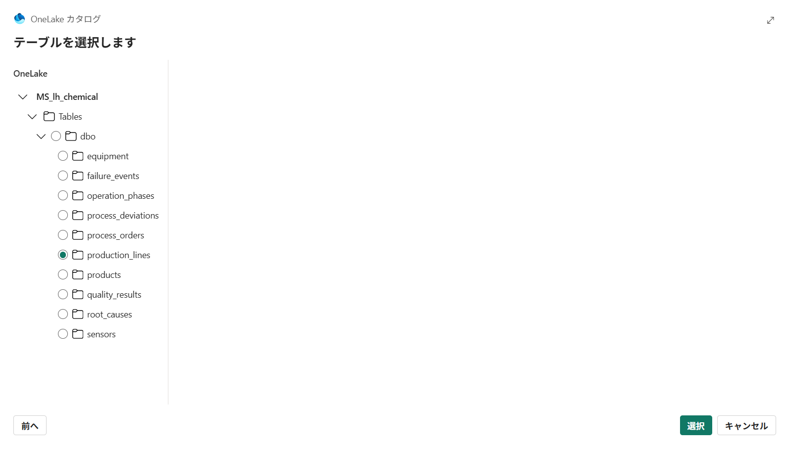
   - ※ 1 件目のエンティティで `[Prefix]_lh_chemical` を選ぶと、2 件目以降は最近使った接続として候補表示されます
5. バインディング設定後、**プロパティ (Properties)** タブにテーブルの列が自動で読み込まれる
6. **エンティティ型キーの定義**　をクリック。
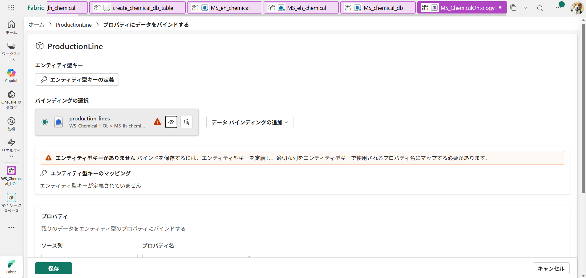
**キー列 (Entity ID)** に上表の「キー列」を選択（例: `production_line_id`）
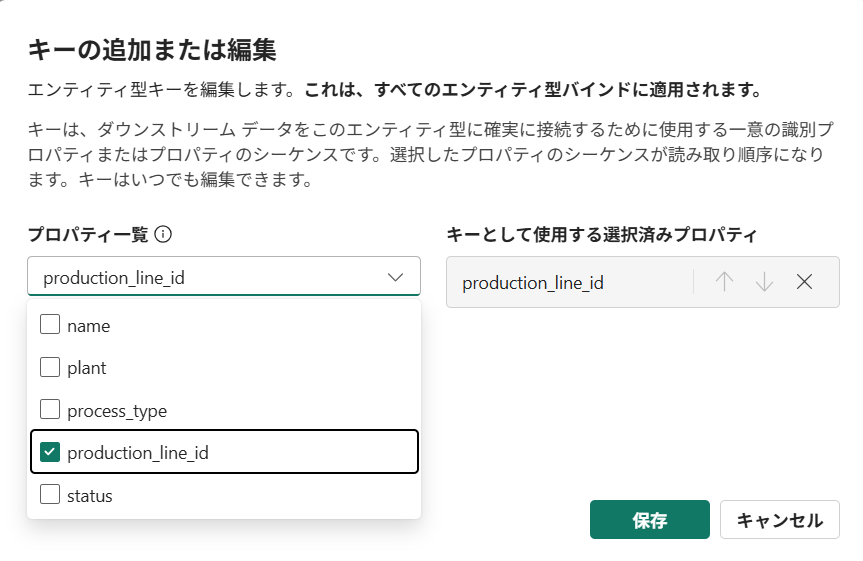
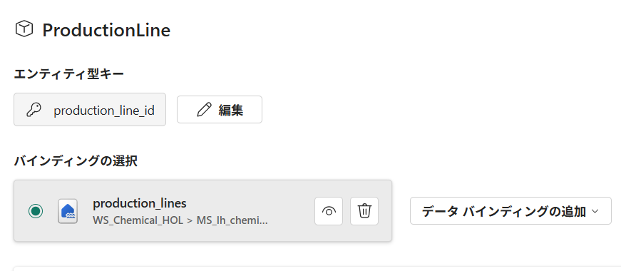

7. **プロパティ** で型マッピングを確認
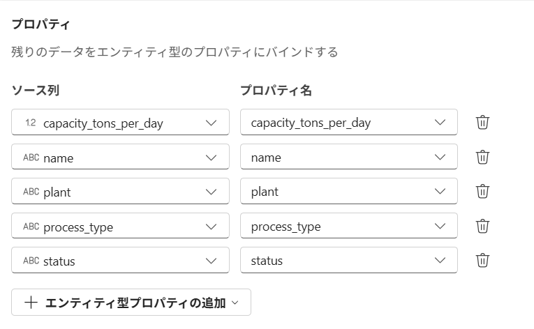

8. **保存** をクリックします
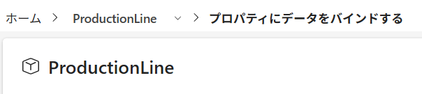

9. 上部のProductionLineをクリックします。
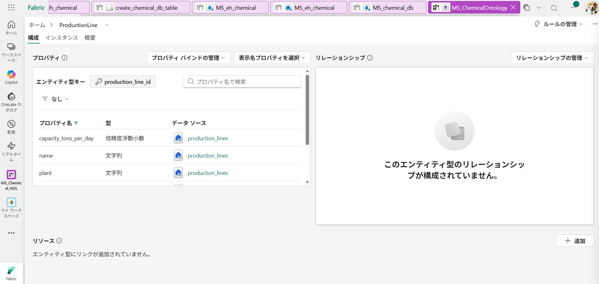

**表示名プロパティを選択** に上表の「表示列」を選択（例: `name`）
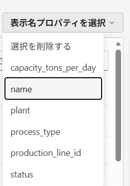

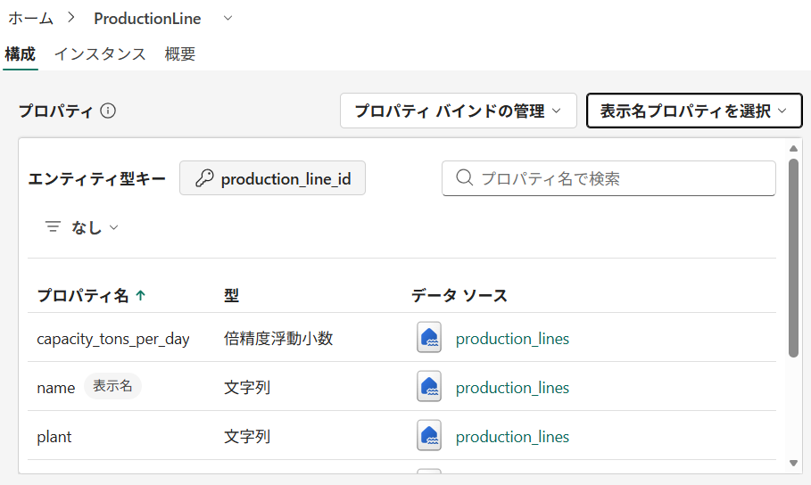

10エンティティすべてで同様の手順を実施してください。
---

## 4. リレーションシップ型の作成（14 件）

上部メニュー **+ リレーションシップ型** から下表の 14 件を追加します。

| # | リレーションシップ名 | ソーステーブル | ソースエンティティ | ソース列 | ターゲットエンティティ | ターゲット列 |
|---|---|---|---|---|---|---|
| 1 | `EquipmentOnLine` | `equipment` | `Equipment` | `equipment_id` | `ProductionLine` | `production_line_id` |
| 2 | `SensorOnEquipment` | `sensors` | `Sensor` | `sensor_id` | `Equipment` | `equipment_id` |
| 3 | `OrderOnLine` | `process_orders` | `ProcessOrder` | `process_order_id` | `ProductionLine` | `production_line_id` |
| 4 | `PhaseInOrder` | `operation_phases` | `OperationPhase` | `operation_phase_id` | `ProcessOrder` | `process_order_id` |
| 5 | `PhaseReadsSensor` | `operation_phases` | `OperationPhase` | `operation_phase_id` | `Sensor` | `primary_sensor_id` |
| 6 | `DeviationFromSensor` | `process_deviations` | `ProcessDeviation` | `process_deviation_id` | `Sensor` | `sensor_id` |
| 7 | `DeviationInPhase` | `process_deviations` | `ProcessDeviation` | `process_deviation_id` | `OperationPhase` | `operation_phase_id` |
| 8 | `DeviationAffectsQuality` | `quality_results` | `QualityResult` | `quality_result_id` | `ProcessDeviation` | `process_deviation_id` |
| 9 | `DeviationEscalatesFailure` | `failure_events` | `FailureEvent` | `failure_event_id` | `ProcessDeviation` | `process_deviation_id` |
| 10 | `FailureCausedByRootCause` | `root_causes` | `RootCause` | `root_cause_id` | `FailureEvent` | `failure_event_id` |
| 11 | `RootCauseEquipment` | `root_causes` | `RootCause` | `root_cause_id` | `Equipment` | `equipment_id` |
| 12 | `RootCausePhase` | `root_causes` | `RootCause` | `root_cause_id` | `OperationPhase` | `operation_phase_id` |
| 13 | `OrderProducesProduct` | `process_orders` | `ProcessOrder` | `process_order_id` | `Product` | `product_id` |
| 14 | `QualityForProduct` | `quality_results` | `QualityResult` | `quality_result_id` | `Product` | `product_id` |

各リレーションシップの作成手順:

1. **+ リレーションシップの追加** をクリック
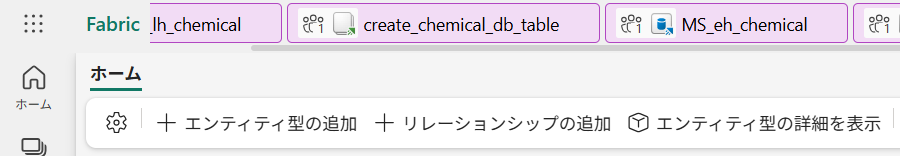

2. **リレーションシップの種類の名前** に上表の「リレーションシップ名」を入力
**Source エンティティ** に「ソースエンティティ」を選択
**Target エンティティ** に「ターゲットエンティティ」を選択し**作成**をクリック
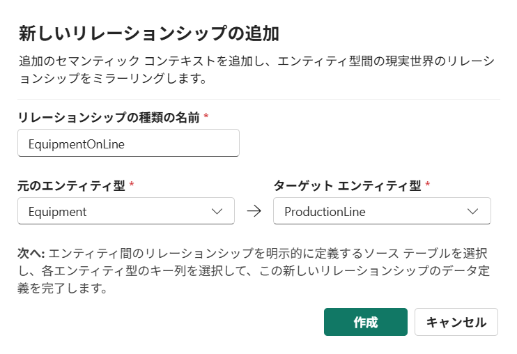

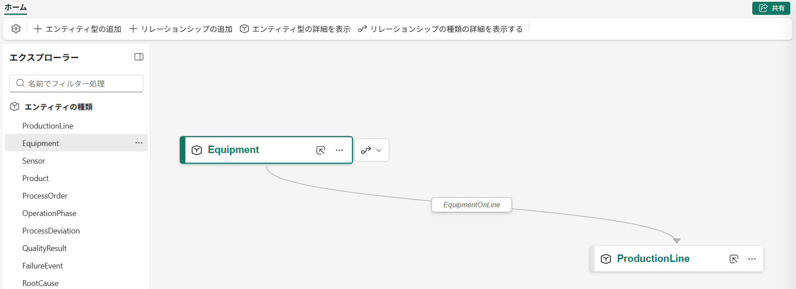

3. 同様にほかのリレーションシップを追加します（合計14）

---

## 5. オントロジーの公開・ビルド

1. 右上の **公開 (Publish)** / **ビルド (Build)** をクリック  
2. バリデーション結果を確認:  
   - エンティティ型: 10 件  
   - リレーションシップ型: 14 件  
   - データバインディング: 各エンティティに 1 件ずつ
3. エラーがあれば該当エンティティ/リレーションシップを修正してから再公開

---

## 6. 検証

1. **データプレビュー** タブから各エンティティを開き、Lakehouse のデータ件数と一致することを確認  
   - `ProductionLine`: 約 5 行  
   - `Equipment`: 約 25 行  
   - `Sensor`: 約 75 行 など（Notebook 01 の生成数に依存）
2. **グラフビュー** でエンティティ間に 14 本のリレーションシップが表示されることを確認
3. 簡単な探索クエリ例:
   - `Equipment → ProductionLine`（EquipmentOnLine）
   - `RootCause → FailureEvent → ProcessDeviation → QualityResult` の連鎖

---

## 7. トラブルシューティング

| 症状 | 対処 |
|---|---|
| エンティティ型作成時に列が表示されない | Lakehouse テーブルのスキーマに `array`/`struct`/`map` が含まれていないか確認。Notebook 01 を再実行 |
| `DateTime` 型として認識されない | Spark スキーマで `string` になっていないか確認。必要なら CAST して書き直す |
| リレーションシップが「無効」 | Source/Target エンティティのキー列名と、Contextualization の列名が一致しているか確認 |
| 公開時 HTTP 409 | 同名オントロジーが既に存在。一度削除して 30 秒以上待ってから再公開 |
| Lakehouse が選択できない | テナント設定で **Ontology (preview)** が有効か、また当該ユーザーがワークスペースの Contributor 以上か確認 |
| プロパティ ID 重複エラー | （REST API 時のみ）`generate_id()` のシードを変更して再実行 |

---

## 8. 完了チェックリスト

- [ ] オントロジー `ChemicalOntology_AutoGen` が作成された
- [ ] 10 個のエンティティ型が登録され、それぞれ Lakehouse テーブルにバインドされている
- [ ] 各エンティティのキー列・表示列が正しく設定されている
- [ ] 14 個のリレーションシップ型が登録され、Contextualization が設定されている
- [ ] 公開（Publish）が成功しエラーなし
- [ ] グラフビューでネットワークが想定通り描画される

