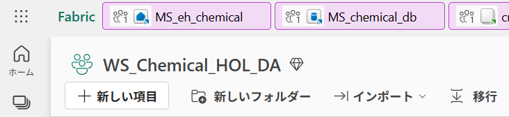
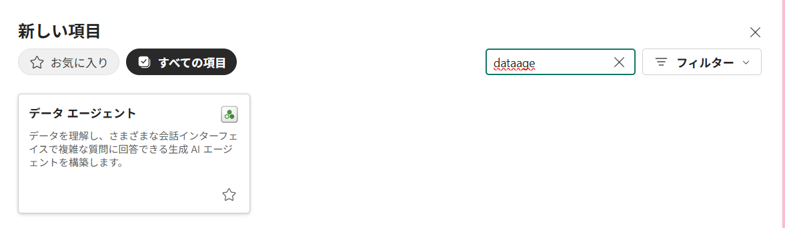
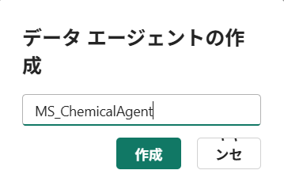
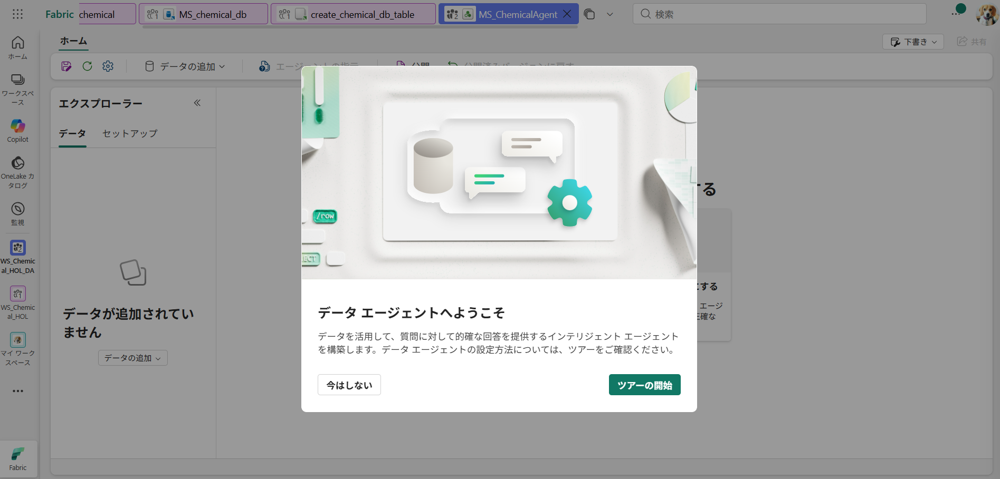
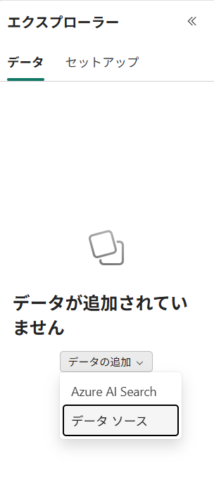
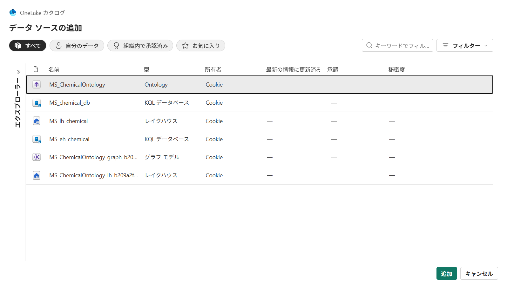
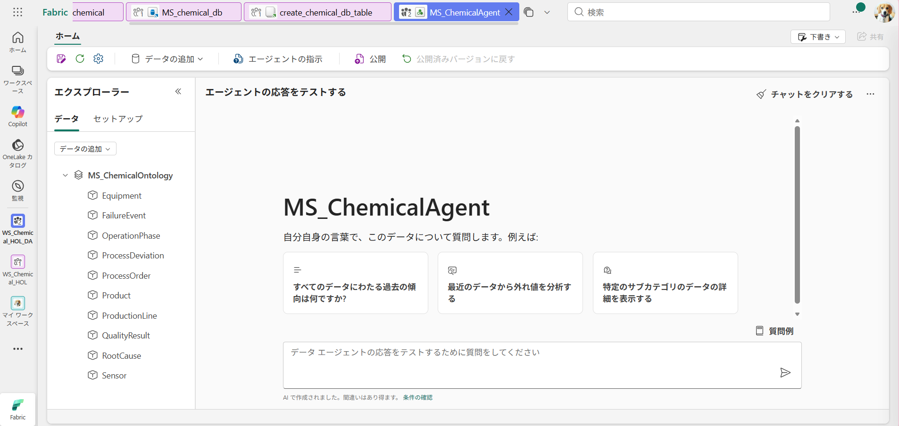
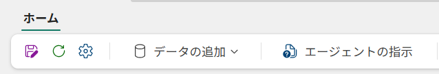
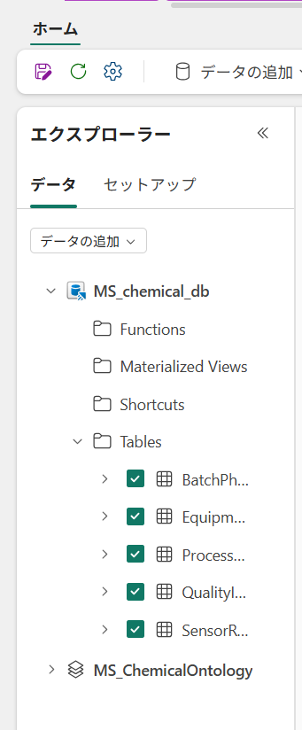
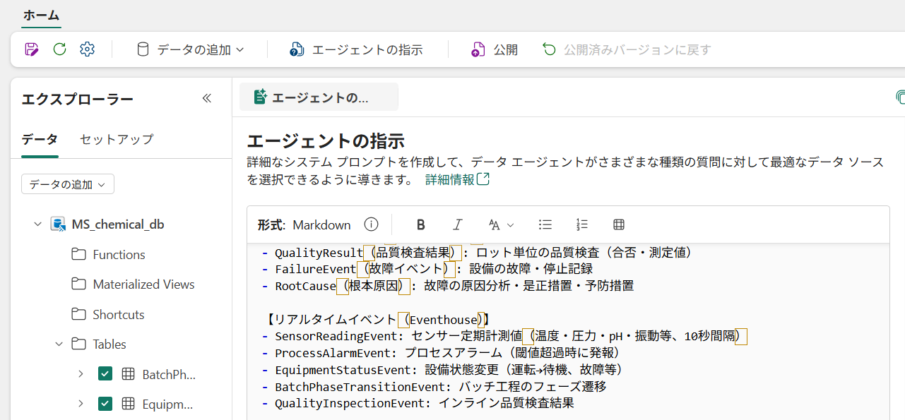

# Step7. DataAgent の作成

##  1: Data Agent アイテムの作成

1. **Fabric ポータル** にサインインし、対象ワークスペースを開く。
2. ワークスペース画面上部の **＋ 新しいアイテム** をクリック。

3. アイテム ギャラリーの検索ボックスに **`Data agent`** と入力。
4. **Data agent** を選択。

5. 名前に **`[Prefix]_ChemicalAgent`** を入力し、**作成**　をクリック。


---

##  2: オントロジーをデータソースとして接続

1. Data Agent エディター画面で、左ペインの **＋ データの追加** をクリック。


2. 左側のエクスプローラーの **<<** を開き、ワークスペースを選択。
3. ワークスペース内のから **`[Prefix]_ChemicalOntology`** を選択。

4. **追加**（Add）をクリックして確定。


##  3:　イベントハウスをデータソースとして接続
1. Data Agent エディター画面で、上部の **＋ データの追加**（Add data source）をクリック。

2. ワークスペース内から **`[Prefix]_chemical_db`** を選択。
4. **追加**（Add）をクリックして確定。
5. **`chemical_db`** のTablesのなかの各テーブルにチェックをいれます。
- SensorReadingEvent
- ProcessAlarmEvent
- EquipmentStatusEvent
- BatchPhaseTransitionEvent
- QualityInspectionEvent


接続後、Data Agent は以下のエンティティ型・プロパティ・リレーションシップを自動的に認識します。

### 参照エンティティ（マスターデータ）
- ProductionLine（製造ライン）
- Equipment（設備）
- Sensor（センサー）
- Product（製品）
- ProcessOrder（プロセスオーダー）
- OperationPhase（オペレーションフェーズ）
- ProcessDeviation（プロセス逸脱）
- QualityResult（品質検査結果）
- FailureEvent（故障イベント）
- RootCause（根本原因）

### リアルタイムイベント（Eventhouse）
- SensorReadingEvent
- ProcessAlarmEvent
- EquipmentStatusEvent
- BatchPhaseTransitionEvent
- QualityInspectionEvent

---

##  3: 指示文（Instructions / システムプロンプト）を設定

1. Data Agent エディター上部タブの **エージェントの指示** パネルを開く。
2. 既存のテキストをクリアし、下記のテキストをそのまま貼り付け。


```text
あなたは化学プラント運転管理アシスタントです。以下の化学プラントオントロジーにアクセスできます。

- Chiba plant:千葉プラント
- Ehime plant:愛媛プラント
- Singapore plant:シンガポールプラント

【マスターデータ（参照エンティティ）】
- ProductionLine（製造ライン）: プラント内の製造ライン（連続プロセス・バッチプロセス）
- Equipment（設備）: 反応器、蒸留塔、ミキサー、コンプレッサー、ポンプ等
- Sensor（センサー）: 温度・圧力・pH・振動・流量等の計測器
- Product（製品）: ポリマー、溶剤、中間体、特殊化学品
- ProcessOrder（プロセスオーダー）: バッチ番号と製品を紐づけた製造指示
- OperationPhase（オペレーションフェーズ）: 反応・蒸留・精製・乾燥・冷却等の工程
- ProcessDeviation（プロセス逸脱）: 温度逸脱・圧力スパイク・液位アラーム等
- QualityResult（品質検査結果）: ロット単位の品質検査（合否・測定値）
- FailureEvent（故障イベント）: 設備の故障・停止記録
- RootCause（根本原因）: 故障の原因分析・是正措置・予防措置

【リアルタイムイベント（Eventhouse）】
- SensorReadingEvent: センサー定期計測値（温度・圧力・pH・振動等、10秒間隔）
- ProcessAlarmEvent: プロセスアラーム（閾値超過時に発報）
- EquipmentStatusEvent: 設備状態変更（運転→待機、故障等）
- BatchPhaseTransitionEvent: バッチ工程のフェーズ遷移
- QualityInspectionEvent: インライン品質検査結果

【回答時のルール】
- ユーザーは日本語で質問します。必ず日本語で回答してください。
- フラットなテーブル検索ではなく、オントロジーグラフのリレーションシップを活用すること
- リアルタイムの質問（現在の温度、アラーム状況）にはイベントエンティティを使用
- 設備・製品・品質に関する質問には参照エンティティを使用
- 回答にはデータの根拠を必ず示すこと
- ユーザーが明示的に求めない限り、IDは返さないこと
- プロセス逸脱を議論する際は、deviation_type と handling_status の両方を参照
- 品質問題の際は、関連する process_deviation と failure_event も調査
- 設備故障の際は、root_cause の corrective_action と preventive_action を報告
```

---

##  4: サンプル質問で動作確認

Data Agent のチャットペインで以下の質問を順に試し、期待される情報源（エンティティ）が参照されているか確認してください。

| # | 質問 | テスト対象 |
|---|------|------------|
| 1 | 現在アラームが発報しているセンサーはありますか？ | ProcessAlarmEvent + Sensor のトラバーサル |
| 2 | 直近で品質不合格になったバッチはどれですか？ | QualityResult → ProcessOrder → Product |
| 4 | Ethylene Line A の反応器の現在温度は？ | SensorReadingEvent → Equipment → ProductionLine |
| 5 | 最もダウンタイムが長い設備はどれですか？ | FailureEvent → Equipment（downtime_hours 集計） |
| 6 | プロセス逸脱からの根本原因分析結果を教えてください | ProcessDeviation → FailureEvent → RootCause |
| 7 | 現在実行中のバッチの進捗状況は？ | ProcessOrder + OperationPhase（status フィルタ） |
| 8 | メンテナンス中の設備はどれですか？ | Equipment（status="maintenance" フィルタ） |

---

##  5: （任意）公開と共有

1. Data Agent エディター上部の **発行**（Publish）をクリックして公開バージョンを作成。
2. **共有**（Share）から、利用者にアクセス権を付与。
3. 利用者は Fabric ホームの **Data Agent** 一覧、または直接 URL から `ChemicalAgent` を起動して対話可能。
