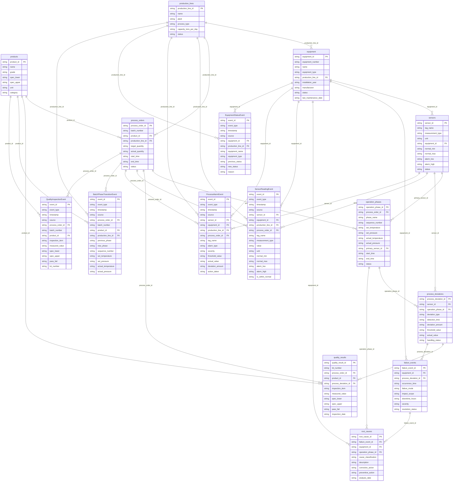

# 化学プラント ER 図 (Mermaid)

```mermaid
erDiagram
    production_lines {
        string production_line_id PK
        string name
        string plant
        string process_type
        string capacity_tons_per_day
        string status
    }
    products {
        string product_id PK
        string name
        string grade
        string spec_lower
        string spec_upper
        string unit
        string category
    }
    equipment {
        string equipment_id PK
        string equipment_number
        string name
        string equipment_type
        string production_line_id FK
        string installation_year
        string manufacturer
        string status
        string last_maintenance_date
    }
    process_orders {
        string process_order_id PK
        string batch_number
        string product_id FK
        string production_line_id FK
        string target_quantity
        string actual_quantity
        string start_time
        string end_time
        string status
    }
    sensors {
        string sensor_id PK
        string tag_name
        string measurement_type
        string unit
        string equipment_id FK
        string normal_min
        string normal_max
        string alarm_low
        string alarm_high
        string status
    }
    operation_phases {
        string operation_phase_id PK
        string process_order_id FK
        string phase_name
        string sequence_number
        string set_temperature
        string set_pressure
        string actual_temperature
        string actual_pressure
        string primary_sensor_id FK
        string start_time
        string end_time
        string status
    }
    process_deviations {
        string process_deviation_id PK
        string sensor_id FK
        string operation_phase_id FK
        string deviation_type
        string detection_time
        string deviation_amount
        string threshold_value
        string actual_value
        string handling_status
    }
    quality_results {
        string quality_result_id PK
        string lot_number
        string process_order_id FK
        string product_id FK
        string process_deviation_id FK
        string inspection_item
        string measured_value
        string spec_lower
        string spec_upper
        string pass_fail
        string inspection_date
    }
    failure_events {
        string failure_event_id PK
        string equipment_id FK
        string process_deviation_id FK
        string occurrence_time
        string failure_mode
        string impact_scope
        string downtime_hours
        string severity
        string resolution_status
    }
    root_causes {
        string root_cause_id PK
        string failure_event_id FK
        string equipment_id FK
        string operation_phase_id FK
        string cause_classification
        string description
        string corrective_action
        string preventive_action
        string analysis_date
    }
    SensorReadingEvent {
        string event_id PK
        string event_type
        string timestamp
        string source
        string sensor_id FK
        string equipment_id FK
        string production_line_id FK
        string process_order_id FK
        string tag_name
        string measurement_type
        string value
        string unit
        string normal_min
        string normal_max
        string alarm_low
        string alarm_high
        string is_within_normal
    }
    ProcessAlarmEvent {
        string event_id PK
        string event_type
        string timestamp
        string source
        string sensor_id FK
        string equipment_id FK
        string production_line_id FK
        string process_order_id FK
        string tag_name
        string alarm_type
        string severity
        string threshold_value
        string actual_value
        string deviation_amount
        string action_taken
    }
    EquipmentStatusEvent {
        string event_id PK
        string event_type
        string timestamp
        string source
        string equipment_id FK
        string production_line_id FK
        string equipment_name
        string equipment_type
        string previous_status
        string new_status
        string reason
    }
    BatchPhaseTransitionEvent {
        string event_id PK
        string event_type
        string timestamp
        string source
        string process_order_id FK
        string batch_number
        string product_id FK
        string production_line_id FK
        string previous_phase
        string new_phase
        string sequence_number
        string set_temperature
        string set_pressure
        string actual_temperature
        string actual_pressure
    }
    QualityInspectionEvent {
        string event_id PK
        string event_type
        string timestamp
        string source
        string process_order_id FK
        string batch_number
        string product_id FK
        string inspection_item
        string measured_value
        string spec_lower
        string spec_upper
        string pass_fail
        string lot_number
    }
    production_lines ||--o{ equipment : "production_line_id"
    products ||--o{ process_orders : "product_id"
    production_lines ||--o{ process_orders : "production_line_id"
    equipment ||--o{ sensors : "equipment_id"
    process_orders ||--o{ operation_phases : "process_order_id"
    sensors ||--o{ operation_phases : "primary_sensor_id"
    sensors ||--o{ process_deviations : "sensor_id"
    operation_phases ||--o{ process_deviations : "operation_phase_id"
    process_orders ||--o{ quality_results : "process_order_id"
    products ||--o{ quality_results : "product_id"
    process_deviations ||--o{ quality_results : "process_deviation_id"
    equipment ||--o{ failure_events : "equipment_id"
    process_deviations ||--o{ failure_events : "process_deviation_id"
    failure_events ||--o{ root_causes : "failure_event_id"
    equipment ||--o{ root_causes : "equipment_id"
    operation_phases ||--o{ root_causes : "operation_phase_id"
    sensors ||--o{ SensorReadingEvent : "sensor_id"
    equipment ||--o{ SensorReadingEvent : "equipment_id"
    production_lines ||--o{ SensorReadingEvent : "production_line_id"
    process_orders ||--o{ SensorReadingEvent : "process_order_id"
    sensors ||--o{ ProcessAlarmEvent : "sensor_id"
    equipment ||--o{ ProcessAlarmEvent : "equipment_id"
    production_lines ||--o{ ProcessAlarmEvent : "production_line_id"
    process_orders ||--o{ ProcessAlarmEvent : "process_order_id"
    equipment ||--o{ EquipmentStatusEvent : "equipment_id"
    production_lines ||--o{ EquipmentStatusEvent : "production_line_id"
    process_orders ||--o{ BatchPhaseTransitionEvent : "process_order_id"
    products ||--o{ BatchPhaseTransitionEvent : "product_id"
    production_lines ||--o{ BatchPhaseTransitionEvent : "production_line_id"
    process_orders ||--o{ QualityInspectionEvent : "process_order_id"
    products ||--o{ QualityInspectionEvent : "product_id"
```

> 注: Eventhouse → Lakehouse 参照は KQL レベルの論理参照（外部キー制約なし）。
