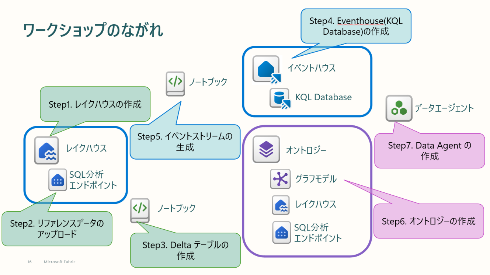

# Chemical-Ontology-Workshop

このリポジトリは[Building an Ontology in Microsoft Fabric: A Trucking Domain Walkthrough](https://github.com/robkerr/trucking-ontology) をもとに化学プラントのオントロジー作成を手作業で行うWorkshopとして組み替えたものです。

*本情報の内容（添付文書、リンク先などを含む）は、作成日時点でのものであり、予告なく変更される場合があります。*

## Workshop コンテンツ
- [step0. 事前準備](./Instruction/step00_preparation.md)
- [Step1. Lakehouse の作成](./Instruction/step01_Lakehouse_Creation.md)
- [Step2. リファレンスデータのアップロード](./Instruction/step02_Upload_reference_data.md)
- [Step3. Delta テーブルの作成](./Instruction/step03_Create_DeltaTable.md)
- [Step4. Eventhouse（KQL Database）の作成](./Instruction/step04_Create_Eventhouse.md)
- [Step5. イベントストリームの生成](./Instruction/step05_Generate_Eventstream.md)
- [Step6. オントロジーの作成](./Instruction/step06_Create_Ontology.md)
- [Step7. Data Agent の作成](./Instruction/step07_Create_DataAgent.md)

## Notebook
Notebook フォルダには Workshop 内で使用する(かもしれない) Notebook が格納されています。
- [03_load_reference_data](./Notebooks/03_load_reference_data.ipynb)
- [05_generate_events](./Notebooks/05_generate_events.ipynb)

- [00_AutoCreation（全自動スクリプト）](./Notebooks/00_AutoCreation.ipynb)

## reference_data
[Step2. リファレンスデータのアップロード](./Instruction/step02_Upload_reference_data.md)および[Step3. Delta テーブルの作成](./Instruction/step03_Create_DeltaTable.md)で使用するデータ

## reference_data_parquet
上記データのparquet版ファイル。Notebookを使わずに手動取り込みが可能。

## Others
このWorkshopデータの[ER図](./Others/chemical_er_diagram.md)が格納されています。

## 既知の問題
- Workspace の名称に特定のマルチバイト文字が含まれている場合、レイクハウススキーマ付きでは作成できません。この場合はStep3及びStep5のノートブックのレイクハウススキーマに関する処理を行っている行のコメントし、スキーマレスのコードのコメントアウトを解除して実行してください。
- JSONL ファイルのDeltaテーブルへの読み込みが失敗することがあります。この場合は、reference_data_parquet内にあるparquetファイルをアップロードし、手動でテーブル化してください。
